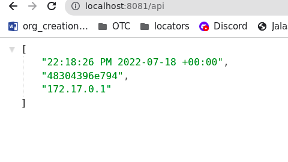

# Steps to create a image and push to docker hub
1. Login in the DockerHub
    docker login

1. Build the docker image
    docker build -t samuellj/dotnet6:samuel.loza .

1. Push Docker image to DockerHub
    docker push samuellj/dotnet6:samuel.loza

# Run docker image in my local environment
1. Run docker image
docker run -p 8081:80 samuellj/dotnet6:samuel.loza 

1. Open Chrome and go to http://localhost/api

Link DockerHub

https://hub.docker.com/repository/docker/samuellj/dotnet6